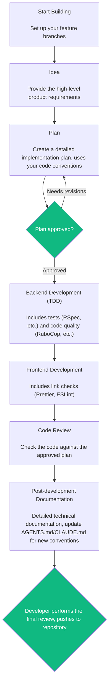

# Kantan Dev

A lean, opinionated feature workflow for **Rails backend + React frontend** projects, packaged as an installable plugin for Claude Code, Cursor, and Codex.



Each step is a skill that activates on demand. While it provides default code direction, Kantan Dev **defers to each repo's own conventions** (`AGENTS.md` / `CLAUDE.md`) instead of hardcoding a stack, and deliberately stays small to save tokens.

## The developer is never out of the loop

Compared to other coding agent workflows that perform the coding flow end-to-end, Kantan Dev deliberately keeps **you** in control of the two decisions that matter:

- **Nothing ships without your approval.** Planning halts until you sign off, and the agent never runs `git add` or `git commit` — every change (code, docs, conventions) stops at your working tree for you to review and push.
- **No hidden side-channels.** No git worktrees and no branch switching. You contol where the code goes all the time.

Agents do the coding legwork, but at the end of the day, *you still own the result*.

## The skills

1. **`kantan-start-feature`** — name the feature, confirm the working branch, capture *your* requirements as an IDEA.
2. **`kantan-plan-feature`** — read the idea + prior docs + repo conventions, ask clarifying questions (never assume), write a plan, and wait for your approval.
3. **`kantan-backend-tdd`** — implement Rails code with TDD; keep RSpec (or the detected suite) and RuboCop (if present) green.
4. **`kantan-frontend`** — implement React changes following the frontend repo's stack; run its formatter then linter.
5. **`kantan-review-feature`** — expert Rails + React review of the changes against the plan, conventions, and best practices; Critical/Major findings block finishing.
6. **`kantan-finish-feature`** — write a "how it was built" doc and fold new reusable patterns into each repo's conventions file.

## Artifacts

All per-feature artifacts live in the **backend root** (the root with a `Gemfile`, or any root that already has a `.kantan-dev/` directory):

| Artifact | Location |
| --- | --- |
| Idea | `<backend>/.kantan-dev/ideas/YYYYMMDD_feature_name.md` |
| Plan | `<backend>/.kantan-dev/plans/YYYYMMDD_feature_name.md` |
| Doc (how-built) | `<backend>/.kantan-dev/docs/YYYYMMDD_feature_name.md` |
| Reusable patterns | each repo's `AGENTS.md` (or `CLAUDE.md` if that's what exists) |

The backend repository houses most of the business logic of the project, and serves as the canonical location for the project-level artifacts/documentation.

## Installation

### Claude Code

```text
/plugin marketplace add marvs/kantan-dev
/plugin install kantan@kantan-dev
```

### Codex

Add the plugin from this repository via the plugin manager:

```text
/plugins
```

Then add `github.com/marvs/kantan-dev`.

### Cursor

Install locally by cloning into Cursor's local plugins directory:

```bash
git clone https://github.com/marvs/kantan-dev ~/.cursor/plugins/local/kantan-dev
```

Then restart Cursor (or run **Developer: Reload Window**).

## Updating your install

Pull the latest version into the tool you installed it in:

- **Claude Code:** `/plugin marketplace update kantan-dev`, then `/reload-plugins` (or restart).
- **Codex:** update Kantan from the `/plugins` manager.
- **Cursor:** refresh your local clone:

  ```bash
  cd ~/.cursor/plugins/local/kantan-dev && git pull
  ```

  Then run **Developer: Reload Window**.

## Design notes

- **Process here, conventions in the repo.** Skills never hardcode stack conventions (quote style, SWR vs Redux, test commands, etc.). They read the target repo's `AGENTS.md`/`CLAUDE.md` and follow it. This lets one plugin serve very different Rails and React repos.
- **Backend is canonical** for `.kantan-dev/` artifacts because it houses the business logic.
- **No anti-rationalization prompting / no hooks** — kept lean on purpose; skills rely on native, description-based activation.

## License

MIT — see [LICENSE](LICENSE).
