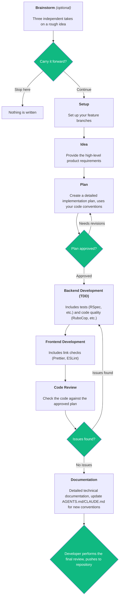

# Kantan Dev

A lean, opinionated feature workflow for **Rails backend + React frontend** projects, packaged as an installable plugin for Claude Code, Cursor, and Codex.


```mermaid
flowchart TD
    Z["<b>Brainstorm</b> <i>(optional)</i><br/><br/>Three independent takes on a rough idea"] --> G0{"Carry it forward?"}
    G0 -->|Stop here| Z1["Nothing is written"]
    G0 -->|Continue| A
    A["<b>Setup</b><br/><br/>Set up your feature branches"] --> B["<b>Idea</b><br/><br/>Provide the high-level product requirements"]
    B --> C["<b>Plan</b><br/><br/>Create a detailed implementation plan, uses your code conventions"]
    C --> G1{"Plan approved?"}
    G1 -->|Needs revisions| C
    G1 -->|Approved| D["<b>Backend Development (TDD)</b><br/><br/>Includes tests (RSpec, etc.) and code quality (RuboCop, etc.)"]
    D --> E["<b>Frontend Development</b><br/><br/>Includes link checks (Prettier, ESLint)"]
    E --> R["<b>Code Review</b><br/><br/>Check the code against the approved plan"]
    R --> G2{"Issues found?"}
    G2 -->|Issues found| D
    G2 -->|No issues| F["<b>Documentation</b><br/><br/>Detailed technical documentation, update AGENTS.md/CLAUDE.md for new conventions"]
    F --> G3{"Developer performs the final review, pushes to repository"}
    style G0 fill:#10B981,color:#fff
    style G1 fill:#10B981,color:#fff
    style G2 fill:#10B981,color:#fff
    style G3 fill:#10B981,color:#fff
```

Each step is a skill that activates on demand. While it provides default code direction, Kantan Dev **defers to each repo's own conventions** (`AGENTS.md` / `CLAUDE.md`) instead of hardcoding a stack, and deliberately stays small to save tokens.

## The developer is never out of the loop

Compared to other coding agent workflows that perform the coding flow end-to-end, Kantan Dev deliberately keeps **you** in control of the two decisions that matter:

- **Nothing ships without your approval.** Planning halts until you sign off, and the agent never runs `git add` or `git commit` — every change (code, docs, conventions) stops at your working tree for you to review and push.
- **No hidden side-channels.** No git worktrees and no branch switching. You control where the code goes all the time.

Agents do the coding legwork, but at the end of the day, _you still own the result_.

## The skills

0. **`kantan-brainstorm`** _(optional)_ — only runs when you say "brainstorm". Three agents take your rough idea from a different angle each — simplicity, scalability and security, user-friendliness — without seeing each other's answers. You get all three in full plus the conflicts between them, then either stop or carry the parts you chose into the idea. Writes no file.
1. **`kantan-start-feature`** — name the feature, confirm the working branch and the base branch, capture _your_ requirements as an IDEA.
2. **`kantan-plan-feature`** — read the idea + prior docs + repo conventions, ask clarifying questions (never assume), write a plan, and wait for your approval.
3. **`kantan-backend-tdd`** — implement Rails code with TDD; keep RSpec (or the detected suite) and RuboCop (if present) green; regenerate `db/schema.rb` from a clean database so its diff contains only this branch's migrations.
4. **`kantan-frontend`** — implement React changes following the frontend repo's stack; run its formatter then linter.
5. **`kantan-review-feature`** — expert Rails + React review of the changes against the plan, conventions, and best practices; Critical/Major findings block finishing.
6. **`kantan-finish-feature`** — write a "how it was built" doc and fold new reusable patterns into each repo's conventions file.

## Artifacts

All per-feature artifacts live in the **backend root** (the root with a `Gemfile`, or any root that already has a `.kantan-dev/` directory):

| Artifact          | Location                                                       |
| ----------------- | -------------------------------------------------------------- |
| Idea              | `<backend>/.kantan-dev/ideas/YYYYMMDD_feature_name.md`         |
| Plan              | `<backend>/.kantan-dev/plans/YYYYMMDD_feature_name.md`         |
| Review            | `<backend>/.kantan-dev/reviews/YYYYMMDD_feature_name.md`       |
| Document          | `<backend>/.kantan-dev/docs/YYYYMMDD_feature_name.md`          |
| Reusable patterns | each repo's `AGENTS.md` (or `CLAUDE.md` if that's what exists) |

Why the backend? The backend repository houses most of the business logic of the project, and can serve as the canonical location for the project-level artifacts/documentation.

It is also highly recommended that you push the artifacts in the repository as well. The agents (and your features) get better as more conventions and patterns are established. You can still opt to exclude them however by adding `.kantan-dev` in your `.gitignore`.

## Installation

### Claude Code

```text
/plugin marketplace add marvs/kantan-dev
/plugin install kantan@kantan-dev
```

### Codex

Add the plugin from this repository via the plugin manager:

```text
/plugins
```

Then add `github.com/marvs/kantan-dev`.

### Cursor

Install locally by cloning into Cursor's local plugins directory:

```bash
git clone https://github.com/marvs/kantan-dev ~/.cursor/plugins/local/kantan-dev
```

Then restart Cursor (or run **Developer: Reload Window**).

## Updating your install

Pull the latest version into the tool you installed it in:

- **Claude Code:** `/plugin marketplace update kantan-dev`, then `/reload-plugins` (or restart).
- **Codex:** update Kantan from the `/plugins` manager.
- **Cursor:** refresh your local clone:

  ```bash
  cd ~/.cursor/plugins/local/kantan-dev && git pull
  ```

  Then run **Developer: Reload Window**.

## Design notes

- **This defines the process, but the conventions are still in the repo.** Skills never hardcode stack conventions (quote style, SWR vs Redux, test commands, etc.). They read the target repo's `AGENTS.md`/`CLAUDE.md` and follow it. This lets one plugin serve very different Rails and React repos.
- **Backend is considered canonical** for `.kantan-dev/` artifacts because it houses the business logic.
- **The review doesn't trust the implementer.** Only decisions _you_ made can be treated as settled during review, and the review file has to name where you made them. The agent's own earlier reasoning is exactly what the review re-opens, tool results are re-run rather than recalled, and anything it chooses not to fix is surfaced for your call instead of closed on its own authority.
- **Artifacts are written in Simplified Technical English.** The plan, review, docs, and conventions entries follow ASD-STE100 — active voice, one idea per sentence, one word per meaning, each technical term explained once. The rule constrains how the text is written, so no second model rewrites it afterwards and no fact drifts. Code, paths, and commands are never simplified.
- **The schema file is regenerated, never trusted.** Running `db:migrate` on a shared development database leaks other branches' tables into `db/schema.rb`. Before the suite runs, the backend skill runs a bundled script that rebuilds the _test_ database from the base branch's schema, runs only this branch's migrations there, and dumps the result. The development database is never touched, the test database is rebuilt on the next test run anyway, and a failure restores the previous file. The review and finish steps re-run the same script as a check.
- **Brainstorming is an optional step.** Kantan shows you multiple approaches to an idea and names where they disagree. You still need to decide which attributes to include in the idea. Hosts without subagents (Cursor, Codex) run the three in sequence.
- **No heavy anti-rationalization prompting / no hooks** — kept lean on purpose; skills rely on native, description-based activation.

## License

MIT — see [LICENSE](LICENSE).
